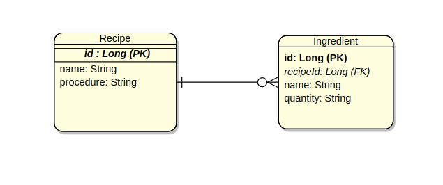
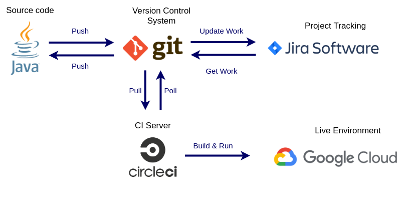
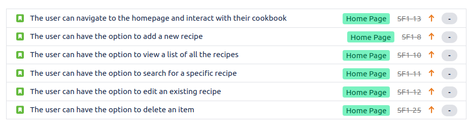
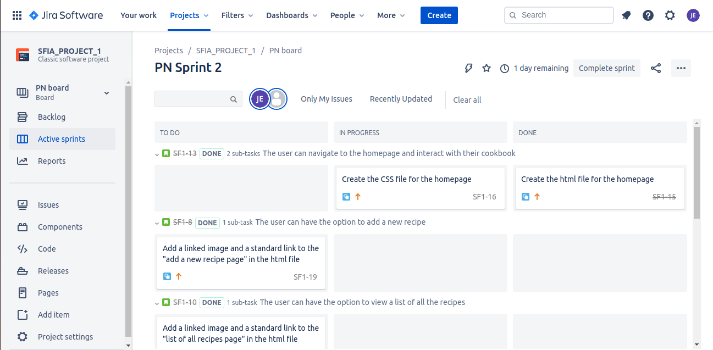
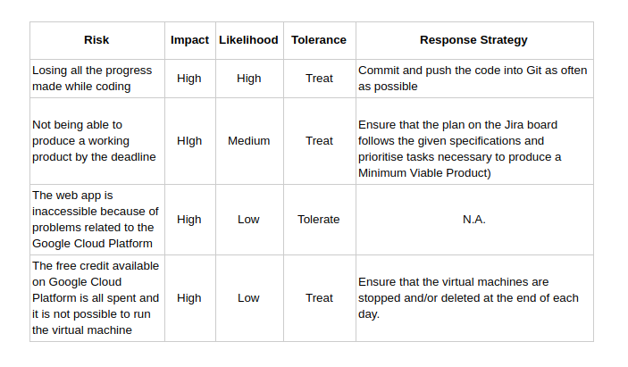
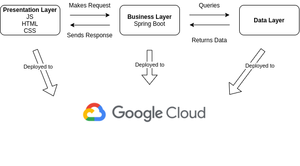
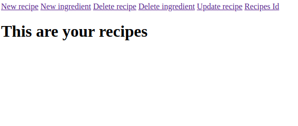
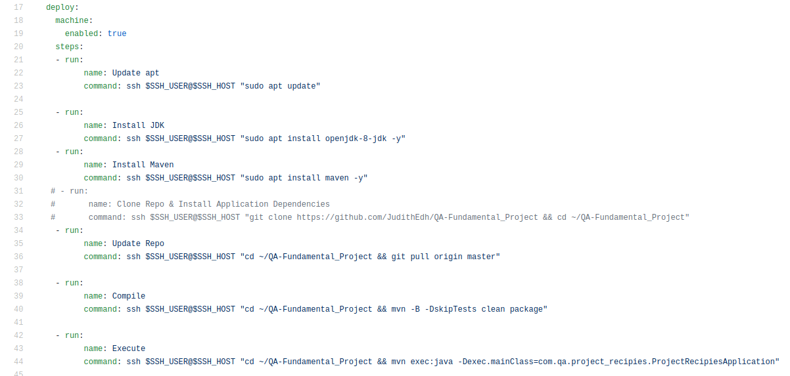

# Recipes Collection: QA SFIA Project

## Introduction
The purpose of the project was to create a CRUD (Create Read Update Delete) application using all the concepts and skills aquired in the first six weeks in QA academy ([Cloud Native - Fundamental Project Specification](https://portal.qa-community.co.uk/~/cne/projects/fundamental--cn)). 

## Table of Contents
- [Requirements](#requirements)
- [Recipes Collection](#recipes-collection)
- [MOSCOW approach](#moscow-approach)
- [Database](#database)
- [CI Pipeline](#ci-pipeline)
- [Planning](#planning)
- [Risk assessment](#risk-assessment)
- [Project components](#project-components)
- [Future work and reflection on the project](#future-work-and-reflection-on-the-project)
- [Summary](#summary)

## Requirements
The requirements are listed below:
- Jira board 
- Clear Documentation 
- Risk Assessment
- A relational database 
- A functional application created in Java
- Front-end website and integrated API
- ~~Fully designed tests~~
- Version Control System
- CI server
- Application deployed to a cloud-based virtual machine

## Recipes Collection
In order to meet the requirements, an application to store recipes was implemented. The application allows the user to create a list of recipes with a description of the procedure to follow, the ingredients needed and their quantity.

## MOSCOW approach

The MOSCOW approach was followed to make sure that the essential features of the app were prioritised and to ensure the creation of a fully functional product that meets all the requirements.
- #### Must Have
1. CRUD functionality at least for the recipes
2. Database to store the recipes
3. Circle CI must deploy the app
4. The app shoild run on a virtual machine spinning in the Google Cloud Platform
5. Clear documentation and planning
- #### Should Have
1. Multiple html pages allowing the user to perform each CRUD functionality
- ### Wont have
1. User login feature
2. Advance design on the front end 

## Database

The following image shows the relationship present between the "Recipe" and "Ingredients" entities.

A recipe can contain more than one ingredient, so there is a one-to-many relationship between the two entities. The primary keys of the tables are the id which are automatically generated and the entities are connected to each other through the foreign key (which is the id of the recipe a particular ingredient belongs to).
The CRUD functionality was implemented in both tables as shown in the following sections. 

## CI Pipeline
The following figure shows which technologies were used and the relationship between them. The source code was implemented in Java and to ensure that the changes on the project will not get lost, a version control system (git) was used. The CI server (circleci) keeps track of any new features added to the application by polling the git repository, and as soon as an update is available, the CI server builds the code and deploys it in the virtual machine running on Google Cloud Platform. Finally, Jira Software was used as a project tracking platform. This process guarantees a continuous integration. 

## Planning
The planning of the project was essential in order to meet the MVP (Minimum Viable Product). The project tracking tool used was a Jira board which allows to produce epics which have user stories with tasks related to them ([Jira Board](https://judithedh.atlassian.net/secure/RapidBoard.jspa?rapidView=1&useStoredSettings=true&atlOrigin=eyJpIjoiNDZlNTMzNTYzNGFjNDViOGJkNjY1ZTNhMzE3Y2IxODkiLCJwIjoiaiJ9)).

In order to interact with the tasks dynamically, "sprints" were created. These are a good way to keep track of the progress of the project because it allows to classify the tasks as "to do", "in progress" or done.

## Risk assessment
In order to avoid unexpected issues from happening, a risk assesment table was produced that showed potential threats to the project and the mitigation strategy chosen. The table is available on the following lik ([Risk assessment table](https://docs.google.com/document/d/1HFkSVNzoGUVQ0q5xYNdBtZqSv8gIKmyCva692vqYvHE/edit?usp=sharing)).

## Project components
### 1. Multi Tier Architecture
The following image shows the multi-tier architecture of the project. 

The user is only able to view the presentation layer which consists of seven web pages acceccible through the following link ([Homepage](http://34.89.53.85:9000/html/RecipesList.html))

### 2. CI Server
The continuous integration server choosen for the project was circleci (as specified in the requirements). The instructions that the server should perform are specified in the .yml file as shown in the image below.

## Future work and reflection on the project
Although the application is fully funcyional and meets the MVP, there are multiple features that could be added to it and things that could have been done better.
### 1. Improve graphics
At the moment, the web application looks basic so the design aspect of the webpages could be improved.
### 2. Smoother continuous integration
Currently, whenever the app runs continuosly on the virtual machine and can be stopped only from the terminal. In the future, extra steps should be added on the .yml file to allow circleci to do it directly.
### 3. Extra functionality
Features such as creating a shopping list that can be downloaded based on the ingredients of a recipe and a user login page could be added in the future.

## Summary
The details of the Recipes Collection web app created as part of QA SFIA Project were described as well as the planning side of the project.

#### Author: Judith Edhogbo

